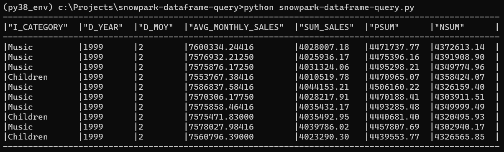

Snowpark DataFrame Query with Python
====================================

Generate a rather complex SQL query with the DataFrame class from Snowpark for Python. I translated here an original code that [I wrote at that time with Snowpark for Scala](https://medium.com/snowflake/how-to-create-a-complex-query-with-snowpark-dataframe-579cf3d9126d).

# Database Profile File

Create a **profiles_db.conf** copy of the **profiles_db_template.conf** file, and customize it with your own Snowflake connection parameters: the account name, the user name, the role and warehouse. Your top [default] profile is the active profile, considered by our tool. Below you may define other personal profiles, that you may override under [default] each time you want to change your active connection.

Use **SNOWFLAKE_SAMPLE_DATA** for your database, and **TPCDS_SF10TCL** for your schema. This shared database should be shared in every new Snowflake account. Beware the executed query may take up to 7 minutes and consume credits!

We connect to Snowflake with the Snowflake Connector for Python. We have code for (a) password-based connection, (b) connecting with a Key Pair, and (c) connecting with SSO. For password-based connection, save your password in a SNOWFLAKE_PASSWORD local environment variable. Never add the password or any other sensitive information to your code or to profile files. All names must be case sensitive, with no quotes.

# CLI Executable File

To compile into a CLI executable:

**<code>pip install pyinstaller</code>**  
**<code>pyinstaller --onefile snowpark-dataframe-query.py</code>**  
**<code>dist\snowpark-dataframe-query</code>**  

# Generate and Run a Complex Schema with DataFrame

After you [setup Snowpark for Python](https://docs.snowflake.com/en/developer-guide/snowpark/python/setup), Run this code and check the executed query in Snowflake's History tab.

**<code>python snowpark-dataframe-query.py</code>**

This must return the following results, after 3-7 minutes:



The original SQL query, on the **SNOWFLAKE_SAMPLE_DATA.TPCDS_SF10TCL** schema - that we translated into Snowpark and tried to rebuild with DataFrame instances - was:

```
-- makeV1(session)
with v1 as (
  select i_category, i_brand, cc_name, d_year, d_moy,
    sum(cs_sales_price) sum_sales,
    avg(sum(cs_sales_price)) over
      (partition by i_category, i_brand, cc_name, d_year)
      avg_monthly_sales,
    rank() over
      (partition by i_category, i_brand, cc_name
       order by d_year, d_moy) rn
  from item
    join catalog_sales
      on cs_item_sk = i_item_sk
    join date_dim
      on cs_sold_date_sk = d_date_sk
    join call_center
      on cc_call_center_sk = cs_call_center_sk
  where d_year = 1999
    or d_year = (1999 – 1) and d_moy = 12
    or d_year = (1999 + 1) and d_moy = 1
  group by i_category, i_brand, cc_name, d_year, d_moy),

-- makeV2(session, v1)
v2 as (
  select v1.i_category, v1.d_year, v1.d_moy,
    v1.avg_monthly_sales, v1.sum_sales,
    v1_lag.sum_sales psum, v1_lead.sum_sales nsum
  from v1
    join v1 v1_lag
      on v1.i_category = v1_lag.i_category
        and v1.i_brand = v1_lag.i_brand
        and v1.cc_name = v1_lag.cc_name
        and v1.rn = v1_lag.rn + 1
    join v1 v1_lead
      on v1.i_category = v1_lead.i_category
        and v1.i_brand = v1_lead.i_brand
        and v1.cc_name = v1_lead.cc_name
        and v1.rn = v1_lead.rn - 1)

-- makeFinal(session, v2)
select *
from v2
where d_year = 1999
  and avg_monthly_sales > 0
  and abs(sum_sales - avg_monthly_sales) / avg_monthly_sales > 0.1
order by sum_sales - avg_monthly_sales, d_moy
limit 10;
```
